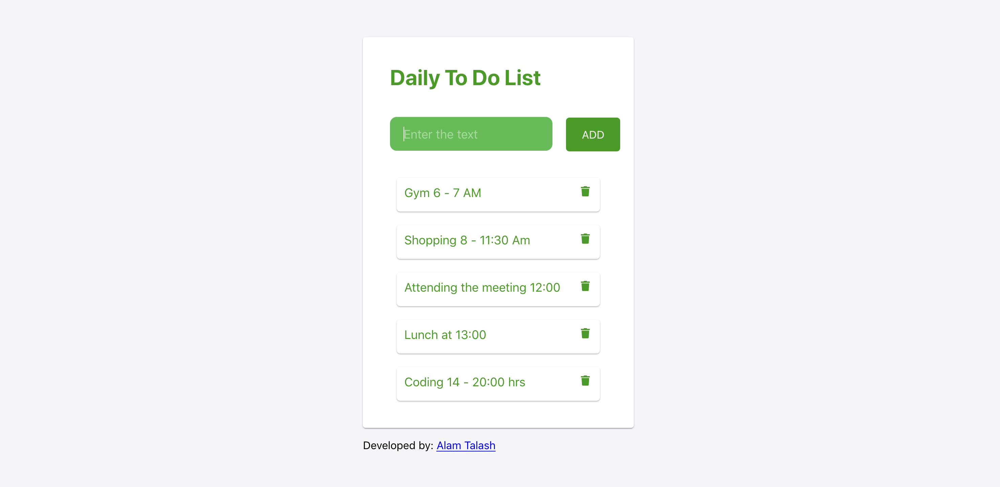

# Daily To Do List

The Daily To Do List App is a very simple App that provides the space where you can list all the jobs that you are going to do it on that day. 

## Features
* Adding the job
* Editing the job
* Deleting the job

## Technologies used
* React js
* CSS
* Material-ui

## Libraries used:
* Font Awesome
* React Flip Move
* Paper

Please click the bellow link to view it online!
https://alam1386.github.io/todolist/

### Developed by:
Alam Talash

### Date: 
Oct - 30 - 2019

